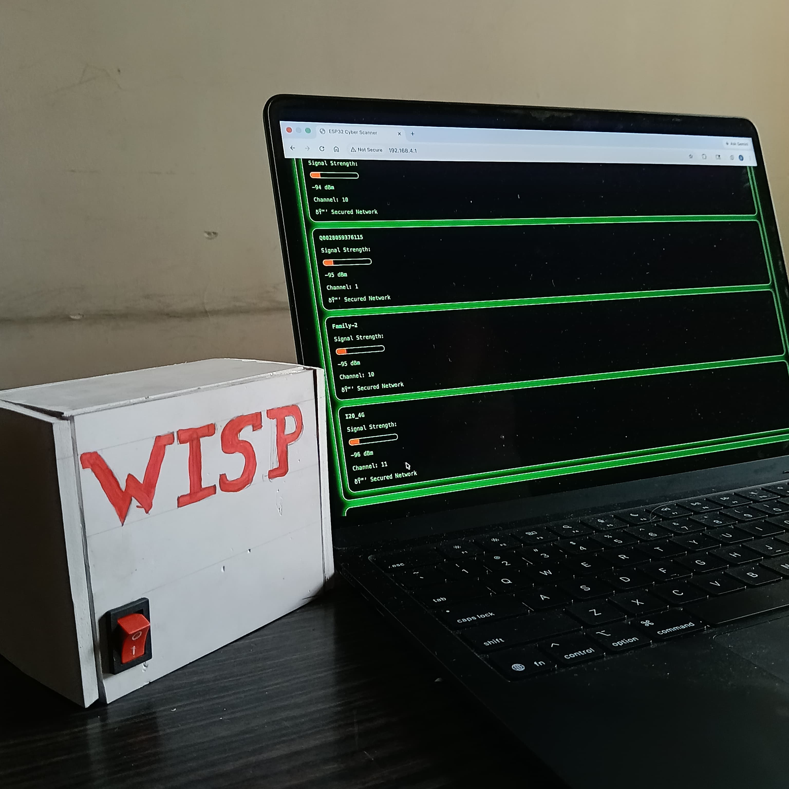
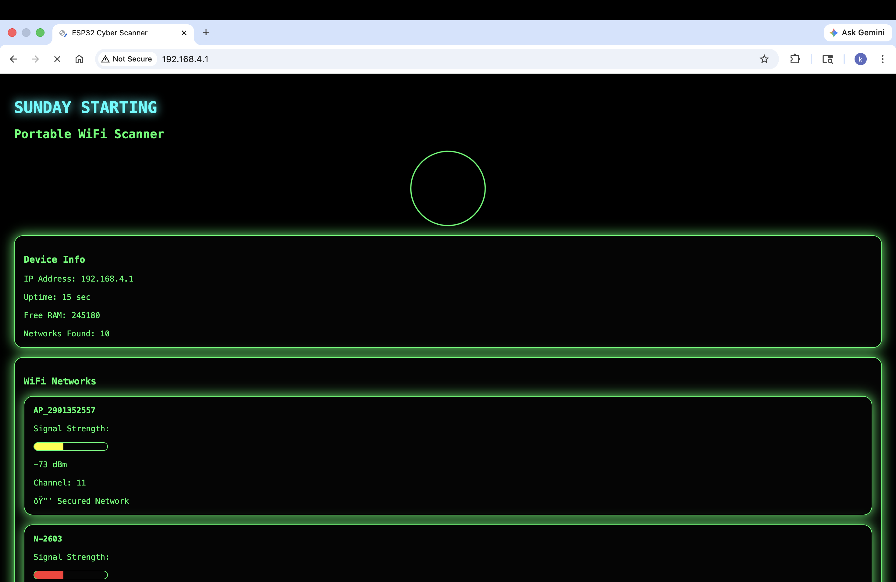
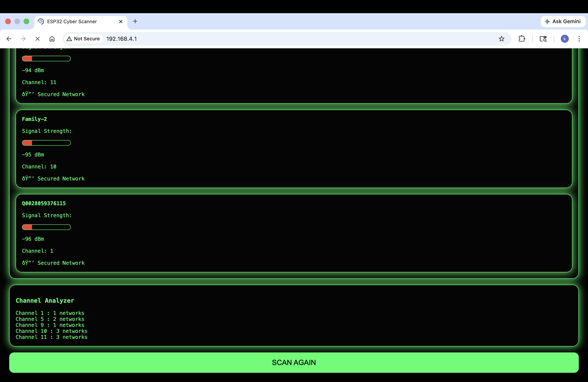

# WISP  
### Wireless Intelligence & Signal Probe

  Portable ESP32-Based WiFi Scanner & Network Analyzer

# 📌 Project Overview

WISP is a portable WiFi scanning and monitoring device built using an ESP32, rechargeable battery setup, and a physical power switch.

The project transforms the ESP32 into a standalone wireless scanning system capable of hosting a live cyber-style web dashboard for monitoring nearby WiFi networks in real time.

The device scans surrounding networks and displays:

- WiFi Names (SSID)
- Signal Strength (RSSI)
- Channel Information
- Open/Secured Status
- Channel Traffic Analysis
- ESP32 System Information

The system is fully portable and operates wirelessly using battery power, making it a compact handheld network analysis tool.

# 🎯 Project Objective

The main objective of WISP was to create a lightweight and portable WiFi analyzer capable of:

- Scanning nearby wireless networks
- Visualizing network strength
- Monitoring WiFi channels
- Hosting a responsive dashboard directly from the ESP32
- Operating independently using portable battery power

# 🚀 Features

- Portable battery-powered design
- Dedicated ON/OFF switch
- ESP32 Access Point mode
- Real-time WiFi scanning
- Live web dashboard
- Signal strength indicator bars
- Open/Secured network detection
- Channel analyzer
- Cyberpunk-inspired UI
- Auto-refreshing webpage
- Lightweight embedded web server

# 🛠 Hardware Components

- ESP32 Development Board
- Rechargeable Battery Module
- Power Switch
- USB Cable
- Jumper Wires

# 💻 Software & Technologies Used

- Arduino IDE
- Embedded C++
- HTML/CSS
- ESP32 WiFi Library
- WebServer Library

# ⚙️ Working Principle

1. The ESP32 starts in WiFi Access Point mode.
2. A local web server is initialized.
3. The ESP32 scans nearby WiFi networks using WiFi.scanNetworks().
4. Network information is stored dynamically.
5. A live dashboard webpage is generated and hosted by the ESP32.
6. Users connect to the WISP hotspot and access the dashboard through a browser.
7. The webpage refreshes automatically to provide updated network information.

# 📊 Dashboard Information

The WISP dashboard displays:

- Device IP Address
- System Uptime
- Free RAM
- Number of Detected Networks
- Signal Quality Visualization
- Channel Distribution Analysis
- Security Status of Nearby Network

# 🎨 UI Design

The dashboard uses a cyber-inspired interface with:

- Neon green styling
- Animated radar effect
- Responsive mobile-friendly layout
- Live signal bars
- Dark-themed futuristic design

# 🔋 Portable Design

WISP was designed as a portable standalone device using:

- Rechargeable battery power
- Dedicated hardware switch for power control
- Wireless dashboard access
- Compact ESP32-based architecture

This allows the system to operate without requiring a continuous USB connection.

# 🧠 Learning Outcomes

Through this project, I explored:

- ESP32 networking
- Embedded web servers
- WiFi scanning techniques
- Real-time data visualization
- HTML generation using microcontrollers
- Portable embedded system design
- IoT dashboard development

# 📷 Project Images

## 🔋 WISP Portable Device

## 📡 WISP Dashboard Device

## 🖥 Dashboard Screenshot

## 🌐 Live Dashboard View

## 🔌 Circuit Diagram

# 📁 Project Structure

bash WISP/ │ ├── WISP.ino ├── README.md │ ├── Images/ │   ├── circuit diagram/ │   │    └── wisp.png │   │ │   ├── Image/ │   │    ├── Image 1.jpeg │   │    └── Image 2.jpeg │   │ │   └── ScreenShot/ │        ├── wisp(screenshot_dashboard_1_).png │        └── wisp(screenshot_dashboard_2_).png 

# ▶️ How To Run

1. Open the project in Arduino IDE  
2. Install the ESP32 board package  
3. Select the correct ESP32 board  
4. Upload WISP.ino  
5. Power the ESP32 using battery or USB  
6. Connect to the WISP WiFi hotspot  
7. Open the IP shown in the Serial Monitor  

# 📡 Example Access

bash SSID: ESP32-Scanner Password: 12345678 

Open browser:

bash 192.168.4.1 

# 📌 Conclusion

WISP demonstrates how an ESP32 can be transformed into a portable wireless monitoring tool with real-time network analysis and an interactive web interface.

The project combines embedded systems, networking, IoT, and frontend dashboard design into a compact portable cybersecurity-style device.

# 👨‍💻 Author

Developed by: caffeinewithclazsy

GitHub: https://github.com/caffeinewithcla